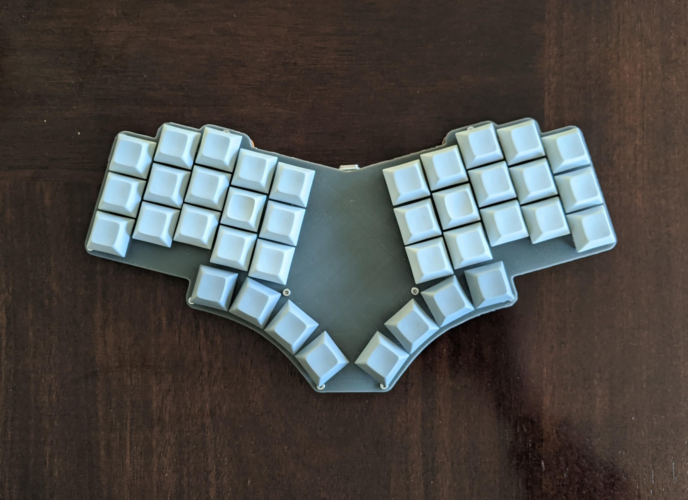
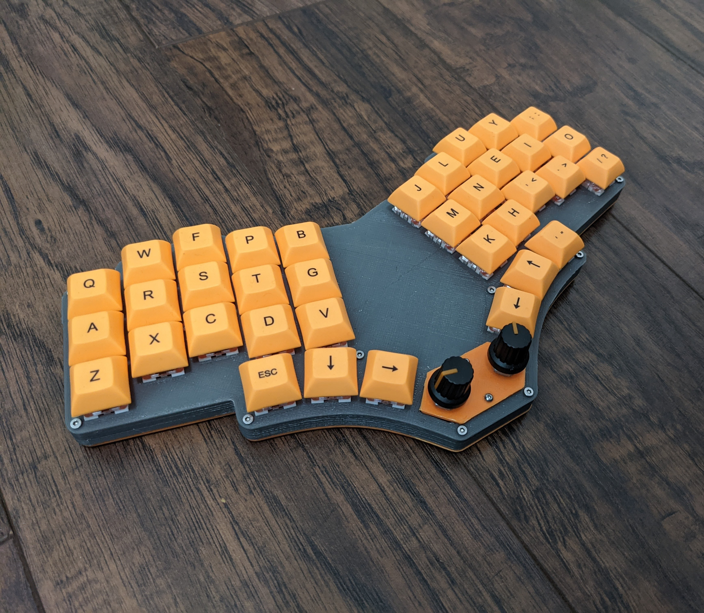

# 3D printable case designs for pteron38

You can use a couple of different combinations to build this case.

Either use:
* bottom-case.stl and switch-plate.stl
* bottom-plate.stl and switch-plate-case.stl

You can also use the rotaryencoder-plate.stl to use the center two switch holes for rotary encoders.

See the images:

